* Table of Contents
{:toc}

--------------------------------------------------------------------------------------------------------------------

## **Introduction**

ParentPal is a desktop application designed for parents to manage their children-related contacts and appointments.
ParentPal is built for use via a Command Line Interface (CLI), the Graphical User Interface (GUI) is primarily meant
for displaying key information. 

ParentPal is largely built with Java. GUI related functionality is powered by JavaFX and CSS.

--------------------------------------------------------------------------------------------------------------------

## **Setting up, getting started**

Refer to the guide [_Setting up and getting started_](SettingUp.md).

--------------------------------------------------------------------------------------------------------------------

## **Design**
The following section provides details of the architecture and a few selected functionalities of the application.

### Architecture

The ***Architecture Diagram*** given above explains the high-level design of the App. Given below is a quick overview of each component.

:bulb: **Tip:** The `.puml` files used to create diagrams in this document can be found in the [diagrams](https://github.com/se-edu/addressbook-level3/tree/master/docs/diagrams/) folder. Refer to the [_PlantUML Tutorial_ at se-edu/guides](https://se-education.org/guides/tutorials/plantUml.html) to learn how to create and edit diagrams.

**`Main`** has two classes called [`Main`](https://github.com/se-edu/addressbook-level3/tree/master/src/main/java/seedu/address/Main.java) and [`MainApp`](https://github.com/se-edu/addressbook-level3/tree/master/src/main/java/seedu/address/MainApp.java). It is responsible for,
* At app launch: Initializes the components in the correct sequence, and connects them up with each other.
* At shut down: Shuts down the components and invokes cleanup methods where necessary.

[**`Commons`**](#common-classes) represents a collection of classes used by multiple other components.

The rest of the App consists of four components.

* [**`UI`**](#ui-component): The UI of the App.
* [**`Logic`**](#logic-component): The command executor.
* [**`Model`**](#model-component): Holds the data of the App in memory.
* [**`Storage`**](#storage-component): Reads data from, and writes data to, the hard disk.

Each of the four components,

* defines its *API* in an `interface` with the same name as the Component.
* exposes its functionality using a concrete `{Component Name}Manager` class (which implements the corresponding API `interface` mentioned in the previous point.

For example, the `Logic` component (see the class diagram given below) defines its API in the `Logic.java` interface and exposes its functionality using the `LogicManager.java` class which implements the `Logic` interface.

**How the architecture components interact with each other**

The *Sequence Diagram* below shows how the components interact with each other for the scenario where the user issues the command `delete 1`.

The sections below give more details of each component.

### UI component

**API** :
[`Ui.java`](https://github.com/se-edu/addressbook-level3/tree/master/src/main/java/seedu/address/ui/Ui.java)

The UI consists of a `MainWindow` that is made up of parts e.g.`CommandBox`, `ResultDisplay`, `PersonListPanel`, etc. All these, including the `MainWindow`, inherit from the abstract `UiPart` class.

The `UI` component uses JavaFx UI framework. The layout of these UI parts are defined in matching `.fxml` files that are in the `src/main/resources/view` folder. For example, the layout of the [`MainWindow`](https://github.com/se-edu/addressbook-level3/tree/master/src/main/java/seedu/address/ui/MainWindow.java) is specified in [`MainWindow.fxml`](https://github.com/se-edu/addressbook-level3/tree/master/src/main/resources/view/MainWindow.fxml)

The `UI` component,

* Executes user commands using the `Logic` component.
* Listens for changes to `Model` data so that the UI can be updated with the modified data.

### Logic component

**API** :
[`Logic.java`](https://github.com/se-edu/addressbook-level3/tree/master/src/main/java/seedu/address/logic/Logic.java)

1. `Logic` uses the `AddressBookParser` class to parse the user command.
1. This results in a `Command` object which is executed by the `LogicManager`.
1. The command execution can affect the `Model` (e.g. adding a contact).
1. The result of the command execution is encapsulated as a `CommandResult` object which is passed back to the `Ui`.
1. In addition, the `CommandResult` object can also instruct the `Ui` to perform certain actions, such as displaying help to the user.

Given below is the Sequence Diagram for interactions within the `Logic` component for the `execute("delete 1")` API call.

:information_source: **Note:** The lifeline for `DeleteCommandParser` should end at the destroy marker (X) but due to a limitation of PlantUML, the lifeline reaches the end of diagram.

### Model component

**API** : [`Model.java`](https://github.com/se-edu/addressbook-level3/tree/master/src/main/java/seedu/address/model/Model.java)

The `Model`,

* stores a `UserPref` object that represents the user’s preferences.
* stores the address book data.
* exposes an unmodifiable `ObservableList<Contact>` that can be 'observed' e.g. the UI can be bound to this list so that the UI automatically updates when the data in the list change.
* does not depend on any of the other three components.

:information_source: **Note:** An alternative (arguably, a more OOP) model is given below. It has a `Tag` list in the `AddressBook`, which `Contact` references. This allows `AddressBook` to only require one `Tag` object per unique `Tag`, instead of each `Contact` needing their own `Tag` object. 
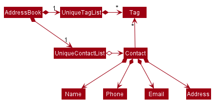

### Storage component

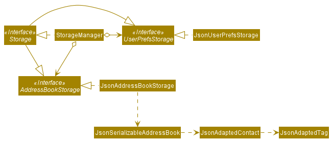

**API** : [`Storage.java`](https://github.com/se-edu/addressbook-level3/tree/master/src/main/java/seedu/address/storage/Storage.java)

The `Storage` component,
* can save `UserPref` objects in json format and read it back.
* can save the address book data in json format and read it back.

### Common classes

Classes used by multiple components are in the `seedu.addressbook.commons` package.

--------------------------------------------------------------------------------------------------------------------

## **Implementation**

This section describes some noteworthy details on how certain features are implemented.
### Tagging features
#### Current Implementation 
The current tagging system uses objects of the `Tag` class and its children `ChildTag`. Each `Contact` in the
`AddressBook` maintains its own set of tags as a `HashSet<Tag>`. 

The `tag` command allows for the appending of tags to an existing
`Contact` without having to replace existing tags as offered by `edit` and is facilitated by 
the `TagCommand` and `TagCommandParser` classes.

As part of the `Model` component, other components interact with tags through the `Model.java` API.
As `Contact` objects are designed to be immutable, commands that involve manipulating Persons such as `edit` and `tag`
involve creating a new `Contact` and replacing the original `Contact` through `Model#setPerson()`.

Given below is an example usage scenario of the `tag` command and how the application behaves through its execution.

Step 1. The user executes `tag 1 tc/Adam t/formteacher` to add tags to a previous contact they have added.

Step 2. The `LogicManager` calls on the `AddressBookParser` to parse the user input
, which creates a new `TagCommandParser` object and calls its `parse` method.

Step 3. `TagCommandParser` will tokenize the given arguments using `ArgumentTokenizer#tokenize()`. 
The `index` of `1` and option fields are parsed out. Since no option is used in this scenario,
the `isReplace` variable is set to `false`.

Step 4. `ParserUtil#parseTags` and `ParserUtil#parseChildTags` methods are used to generate `tagSet`, a `Set<Tag>`
containing `ChildTag:Adam` and `Tag:formteacher`.

Step 5. A new `TagCommand` is created using `index`, `tagSet`, and `isReplace` and returned to `AddressBookParser`
and subsequently `LogicManager`.

Step 6. `LogicManager` then calls the `execute` method of the newly created `TagCommand`.

Step 7. Similar to `EditCommand`, `TagCommand` will generate a new `Contact` object 
though the `createTaggedPerson` method which will have its tags appended with the new `Set<Tag>` defined by the command.

Step 8. The `Model#setPerson()` method is used to update the model with the newly tagged `Contact` and a `CommandResult`
representing success is returned to the `LogicManager`.

Shown below is the sequence diagram that visualises the above operations of a `tag` command.

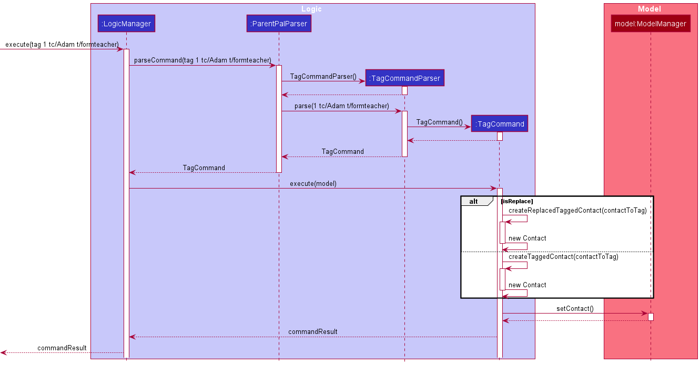

When displaying the tags in the UI as a `PersonCard`, a customised `TagComparator` that implements
`Comparator<Tag>` is used to sort the tags such that `ChildTag` will be placed first before regular
`Tag`. During the generation of the `Label` for the each `Tag` a different background color is then set
for `ChildTag`.

#### Design Considerations

The decision to implement `ChildTag` as its own class rather than a boolean in the `Tag` class was to allow for the 
future extensibility of the program in being able to create more types of Tags in the future. 

This also allows for `ChildTag` to store its own seperate information from regular `Tag` if needed 
such as other details of the child itself. Extending `ChildTag` from the original `Tag` class allows for them to be 
stored within the same data structure allowing for easier manipulation by other commands that may deal with tags such
as `find`.

### Help feature

#### Implementation

The help mechanism is facilitated by `HelpCommandParser` and `HelpCommand`. `HelpCommandParser` implements `Parser#parse(args)` from the `Parser` interface. The `args` passed to the method specify the command to display information for. If `args` specifies more than one command, a parse exception will be thrown. Otherwise, `HepCommandParser` returns a new `HelpCommand`.

If no commands were specified in `args`, the `HelpCommand` constructor without any parameters will be called. If a single command was specified, the command will be passed as an argument to the `HelpCommand(specifiedCommand)` constructor.

:information_source: **Note:** If multiple commands are specified, an exception is thrown.

To execute a `HelpCommand`, `HelpCommand#execute()` is called. The method reads and parses information in the user guide (found at resources/UserGuideCopy.md) into a `helpMessage` differently depending on whether a command was specified. `helpMessage` can contain the following:

* Command was not specified: A list of all available ParentPal commands that was parsed from the command summary table in the user guide.
* Command was specified: Information on the specified command taken from the user guide. If the specified command is not found in the user guide, an exception is thrown.

Given below are 2 example usage scenarios and how the help mechanism behaves in each scenario.

Scenario 1: User enters `help` without specifying commands.

1. `LogicManager#execute(userInput)` calls `AddressBookParser#parseCommand(userInput)`, which then parses the input into the command word and arguments, which is an empty string in this case. The empty string is passed to `HelpCommandParser#parse()`.
2. A new `HelpCommand()` is returned.
3. `LogicManager#execute()` calls `HelpCommand#execute()`, which then calls `HelpCommand#executeNonSpecific()`.
4. The command summary table in the user guide is parsed so that each row is displayed as "commandName: description" in the `helpMessage` with the help of `HelpCommand#commandSummaryParser()`.
5. The `helpMessage` is returned via a `CommandResult`. A default `helpTitle` is also returned via the `CommandResult`.
6. `LogicManager#execute(userInput)` returns the `CommandResult` to `MainWindow#executeCommand`, which sets the help window header to `helpTitle` and the content to `helpMessage` via `HelpWindow#setHelpText()`.
7. The help window is display.

The following sequence diagram shows how the 'help' operation works in this scenario:

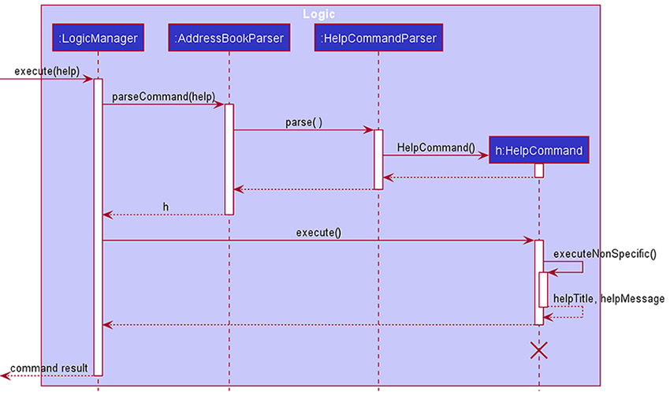

Scenario 2: User enters `help find`.

1. `LogicManager#execute(userInput)` calls `AddressBookParser#parseCommand(userInput)`, which then parses the input into the command word and arguments, `find`. `find` is passed to `HelpCommandParser#parse(find)`.
2. A new `HelpCommand(find)` is returned.
3. `LogicManager#execute()` calls `HelpCommand#execute()`, which then calls `HelpCommand#executeSpecific()`.
4. The user guide is searched for the section containing information on `find`.
5. The information under the `find` section is parsed and appended to `helpMessage`.
6. The `find` section heading is parsed and assigned to `helpTitle`. 
7. The `helpMessage` and `helpTitle` are returned via a `CommandResult`.
8. `LogicManager#execute(userInput)` returns the `CommandResult` to `MainWindow#executeCommand()`, which sets the help window header to `helpTitle` and the content to `helpMessage`.
9. The help window is display.

The following sequence diagram shows how the 'help' operation works in this scenario:

The following activity diagram summarises what happens when a user executes the help command:

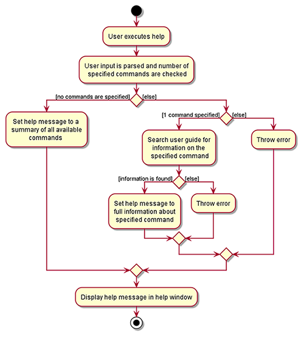

#### Design consideration:

##### Aspect: Where the information displayed in the help window is retrieved from

* **Alternative 1 (current choice):** Retrieve from user guide document stored in resource folder and packed into `JAR` file. 
  * Pros: Easy to update when features change, command classes will not be cluttered with a long `helpMessage` string.
  * Cons: Have to remember to copy the latest version of the user guide from the docs folder into the resources folder, scanning user guide for information each time help is called can be time consuming, have to parse markdown into plain text.

* **Alternative 2:** Retrieve from `helpMessage` string stored in each `Command` class. 
  * Pros: Easy to implement, easy to retrieve `helpMessage`, minimal processing needed.
  * Cons: To update the `helpMessage` of a command, we must search for its class and edit the `helpMessage` string manually. This essentially means we have do 2 updates every time a change is made to a command: one to the user guide and one to the command's class. 

* **Alternative 3:** Retrieve from user guide webpage.
  * Pros: Minimal updating needed when features change since only the user guide in the docs folder needs to be updated.
  * Cons: Does not work when ParentPal is used offline, implementation might be complicated, scanning user guide for information each time help is called can be time-consuming.
  
Alternative 1 was eventually chosen as we were planning to make major changes to ParentPal over several iterations. Since we are already expected to update the user guide with each iteration, it is more efficient to simply copy the latest user guide document into the resources folder after updates are made rather than to edit each `helpMessage`. Furthermore, as long as the format of the user guide remains constant, parsing the markdown text into plain text is manageable and does not take too much time. This alternative will also work when ParentPal is used offline, making the application easy to use on the go. Lastly, alternative 1 keeps the actual code and documentation separate, making it a more logical and organised implementation. As such, that is the alternative that was chosen. 

### Sort feature

#### Implementation

The sort mechanism is facilitated by `SortCommand` and `SortCommandParser`.

`SortCommandParser` implements the following operation:
* `SortCommandParser#parse(String order)` — Parses the arguments using `ArgumentTokenizer#tokenize`
  and checks for `option`.

`SortCommand` extends `Command`, and implements the following operation:
* `SortCommand#execute(Model model)` — Executes the sort command by sorting the `lastShownList`
  and updating the `model` accordingly.

Sorting by name is done by comparing `Contact` objects, which implement `Comparable<Contact>`.

Sorting by date is done using the `DateComparator`, which compares the `TimeAdded` attribute of the `Contact` objects.

Given below is an example usage scenario and how the sort mechanism behaves at each step.

Step 1. The user executes `add n/David …​`, `add n/Anna …​` and `add n/Chloe …​` in that order.
The `Contact` objects created will be timestamped with the `TimeAdded` attribute.
By default, they will be displayed on in the order in which they were added.

[comment]: <> (add UML diagram)

Step 2. The user executes `sort o/name`.

(Add more steps)

[comment]: <> (add UML diagram)

The following sequence diagram shows how the sort operation works:

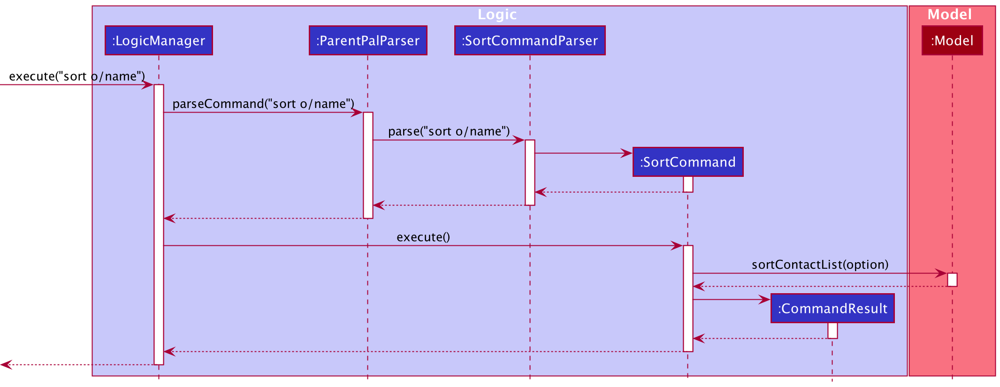
Note: Style of diagram to be updated.

### Add feature

#### Implementation

The add mechanism is facilitated by `AddCommand` and `AddCommandParser`.

`AddCommandParser` implements the following operation:
* `AddCommandParser#parse(String order)` — Parses the arguments using `ArgumentTokenizer#tokenize`
  and checks for if the various `args` are specified, only the `n/` arg is 
  compulsory to be specified.

`AddCommand` extends `Command`, and implements the following operation:
* `AddCommand#execute(Model model)` — Executes the add command by 
  adding the contact with the given `args`, if one of more args are not 
  specified a 'NIL' is automatically used as a placeholder.
  
Given below is an example usage scenario and how the add mechanism behaves at each step.

Step 1. The user executes `add n/David `. Since only the `n/` arg is specified, 
'NIL' will be used for the remaining args.

[comment]: <> (add UML diagram)

The following sequence diagram shows how the add operation works:

[Add sequence diagram]

Note: Style of diagram to be updated.

### \[Proposed\] Appointment feature

#### Proposed Implementation

An appointment feature will be implemented in the next version of this application. It is a useful feature for parents to track any important appointments
related to their children. For example, a parent teacher meeting or a birthday party at the house of their child's friend. 

##### UI Component

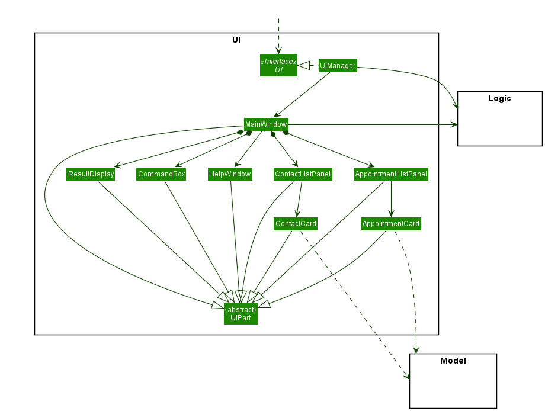

The appointment will be added as a column beside the current address column.

##### Model Component

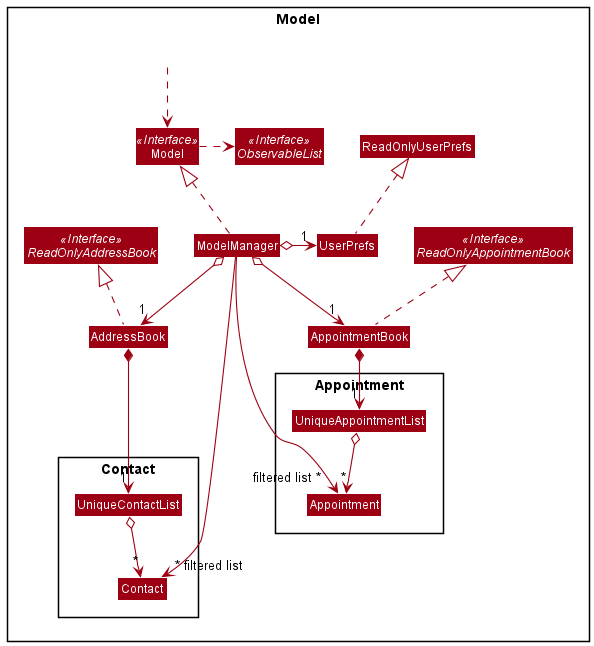

As shown in the diagram above, the proposed appointment feature is facilitated by `AppointmentBook`. It is similar to `AddressBook`, with similar methods
that are related to appointment instead. `AppointmentBook` contains `UniqueAppointmentList` that stores `Appointment` objects by
implementing `Iterable<Appointment>`. `AppointmentBook` implements the interface `ReadOnlyAppointmentBook`.

A filtered list of `Appointment` objects is maintained by `ModelManager`. 

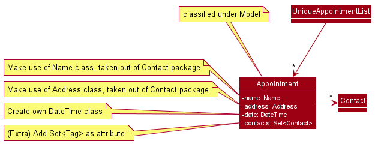

Attributes of the `Appointment` class:
* Name of appointment, which is a String object
* Location of appointment, which is a String object
* Date of appointment, which is a DateTime object
* Contacts that parents might need to contact about the appointment. This is an ArrayList of Contact objects.

##### Logic Component

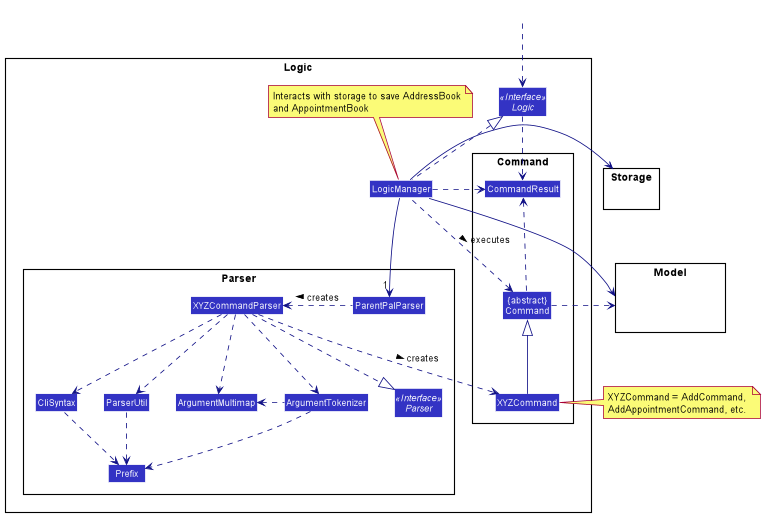

`ParentPalParser` looks at the user command and determines which command it is. After determing the correct command, it creates a parser
for that particularly command.  

The main methods for the appointment feature include `AddAppointmentCommand`, `DeleteAppointmentCommand` and `FindAppointmentCommand`. These methods interact with other components in a similar way
to similar methods for AddressBook. 
* For `AddAppointmentCommand`, adding of contacts is handled by `AppointmentBook#addAppointment`, similar to how adding of addresses is handled by `AddressBook#addPerson()`. 
* For `FindAppointmentCommand`, a predicate defined by given keywords is fed to the filtered list of `Appointment` handled by `ModelManager`, and this filters the `Appointment` objects.
* For `DeleteAppointmentCommand`, `Appointment` is selected to be deleted by the given `index`.

:information_source: **Note:** FindAppointmentCommand only supports finding by the name of the appointment.

##### Storage Component

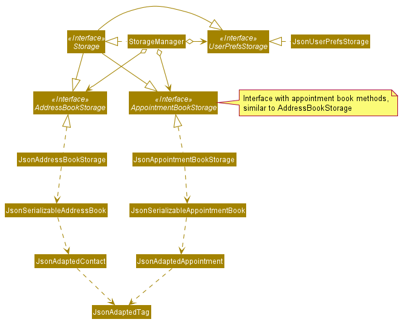

### \[Proposed\] Undo/redo feature

#### Proposed Implementation

The proposed undo/redo mechanism is facilitated by `VersionedAddressBook`. It extends `AddressBook` with an undo/redo history, stored internally as an `addressBookStateList` and `currentStatePointer`. Additionally, it implements the following operations:

* `VersionedAddressBook#commit()` — Saves the current address book state in its history.
* `VersionedAddressBook#undo()` — Restores the previous address book state from its history.
* `VersionedAddressBook#redo()` — Restores a previously undone address book state from its history.

These operations are exposed in the `Model` interface as `Model#commitAddressBook()`, `Model#undoAddressBook()` and `Model#redoAddressBook()` respectively.

Given below is an example usage scenario and how the undo/redo mechanism behaves at each step.

Step 1. The user launches the application for the first time. The `VersionedAddressBook` will be initialized with the initial address book state, and the `currentStatePointer` pointing to that single address book state.

Step 2. The user executes `delete 5` command to delete the 5th contact in the address book. The `delete` command calls `Model#commitAddressBook()`, causing the modified state of the address book after the `delete 5` command executes to be saved in the `addressBookStateList`, and the `currentStatePointer` is shifted to the newly inserted address book state.

Step 3. The user executes `add n/David …​` to add a new contact. The `add` command also calls `Model#commitAddressBook()`, causing another modified address book state to be saved into the `addressBookStateList`.

:information_source: **Note:** If a command fails its execution, it will not call `Model#commitAddressBook()`, so the address book state will not be saved into the `addressBookStateList`.

Step 4. The user now decides that adding the contact was a mistake, and decides to undo that action by executing the `undo` command. The `undo` command will call `Model#undoAddressBook()`, which will shift the `currentStatePointer` once to the left, pointing it to the previous address book state, and restores the address book to that state.

:information_source: **Note:** If the `currentStatePointer` is at index 0, pointing to the initial AddressBook state, then there are no previous AddressBook states to restore. The `undo` command uses `Model#canUndoAddressBook()` to check if this is the case. If so, it will return an error to the user rather
than attempting to perform the undo.

The following sequence diagram shows how the undo operation works:

:information_source: **Note:** The lifeline for `UndoCommand` should end at the destroy marker (X) but due to a limitation of PlantUML, the lifeline reaches the end of diagram.

The `redo` command does the opposite — it calls `Model#redoAddressBook()`, which shifts the `currentStatePointer` once to the right, pointing to the previously undone state, and restores the address book to that state.

:information_source: **Note:** If the `currentStatePointer` is at index `addressBookStateList.size() - 1`, pointing to the latest address book state, then there are no undone AddressBook states to restore. The `redo` command uses `Model#canRedoAddressBook()` to check if this is the case. If so, it will return an error to the user rather than attempting to perform the redo.

Step 5. The user then decides to execute the command `list`. Commands that do not modify the address book, such as `list`, will usually not call `Model#commitAddressBook()`, `Model#undoAddressBook()` or `Model#redoAddressBook()`. Thus, the `addressBookStateList` remains unchanged.

Step 6. The user executes `clear`, which calls `Model#commitAddressBook()`. Since the `currentStatePointer` is not pointing at the end of the `addressBookStateList`, all address book states after the `currentStatePointer` will be purged. Reason: It no longer makes sense to redo the `add n/David …​` command. This is the behavior that most modern desktop applications follow.

The following activity diagram summarizes what happens when a user executes a new command:

#### Design consideration:

##### Aspect: How undo & redo executes

* **Alternative 1 (current choice):** Saves the entire address book.
  * Pros: Easy to implement.
  * Cons: May have performance issues in terms of memory usage.

* **Alternative 2:** Individual command knows how to undo/redo by
  itself.
  * Pros: Will use less memory (e.g. for `delete`, just save the contact being deleted).
  * Cons: We must ensure that the implementation of each individual command are correct.

--------------------------------------------------------------------------------------------------------------------

## **Documentation, logging, testing, configuration, dev-ops**

* [Documentation guide](Documentation.md)
* [Testing guide](Testing.md)
* [Logging guide](Logging.md)
* [Configuration guide](Configuration.md)
* [DevOps guide](DevOps.md)

--------------------------------------------------------------------------------------------------------------------

## **Appendix: Requirements**

### Product scope

**Target user profile**:

* tech-savvy parents
* need to manage a significant number of their young children's contacts
* prefer desktop apps over other types
* can type fast
* prefers typing to mouse interactions
* is reasonably comfortable using CLI apps

**Value proposition**: 
* manage contacts faster than a typical mouse/GUI driven app
* easily keep track of their children's contacts in one centralised platform
* organise, categorise and sort their contacts easily

### User stories

Priorities: High (must have) - `* * *`, Medium (nice to have) - `* *`, Low (unlikely to have) - `*`

| Priority | As a …​                                    | I want to …​                     | So that I can…​                                                        |
| -------- | ------------------------------------------ | ------------------------------ | ---------------------------------------------------------------------- |
| `* * *`  | new user                                   | see usage instructions         | refer to instructions when I forget how to use the App                 |
| `* * *`  | user                                       | add a new contact               |                                                                        |
| `* * *`  | user                                       | delete a contact                | remove entries that I no longer need                                   |
| `* * *`  | user                                       | find a contact by name          | locate details of contacts without having to go through the entire list |
| `* *`    | user                                       | hide private contact details   | minimize chance of someone else seeing them by accident                |
| `*`      | user with many contacts in the address book | sort contacts by name           | locate a contact easily                                                 |
| `* * *`  | Beginner	                                | Add contacts	                 | add contacts                                                     |
| `* *`	   | User	                                    | Add incomplete contacts	     | easily save contacts I don't have all the contact information for easily without having to use placeholders
| `* *`    | Beginner	                                | Add contacts easily 	         | save time
| `* * *`  | Beginner	                                | Update contacts	             | change the details of my contacts
| `* * *`  | Beginner	                                | Be able to view a user guide	 | learn to use the app
| `* * *`  | Parent of multiple children	            | Be able to view a user guide	 | troubleshoot any problems that I encounter
| `* * *`  | Parent of multiple children	            | Tag my contacts by child	     | easily identify which child the contact is related to
| `* * *`  | User	                                    | Tag my contacts by other categories	| identify the contacts more easily (i.e. by subject, lesson etc.)
| `*`      | Beginner	                                | Download the app easily	     | use the app quickly
| `* *`    | Beginner	                                | Add photos to contacts	     | match the contacts' names to their faces easily
| `*`      | User	                                    | Colour code my tags	         | easily differentiate my contacts at a glance
| `* *`    | User	                                    | Search for contacts by tag	 | search for contacts quickly and easily
| `* * *`  | User	                                    | Search for contacts by name    | search for contacts quickly and easily
| `*`      | User	                                    | Search for contacts by number  | search for contacts quickly and easily
| `* *`    | User	                                    | Sort my contacts by tag	     | search for contacts quickly and easily
| `* *`    | User	                                    | Sort my contacts by name	     | search for contacts quickly and easily
| `*`      | User	                                    | Sort my contacts by the closest appointment time	| find out my next upcoming appointment quickly.
| `* *`    | User	                                    | Export my contacts	         | share the contacts with other people/transfer to other devices.
| `*`      | User	                                    | Sync my contacts with my partner | add or update the contacts for our children once such that both of us are able to see the changes.
| `* *`    | User	                                    | Remove all contacts saved under a certain tag	| quickly clear contacts that I no longer need because my child has graduated.
| `* *`    | User	                                    | Remove all selected contacts	 |quickly clear contacts that I no longer need
| `*`      | User who works under different lighting conditions	| Change the colour scheme of my app | view the contents more clearly and my app looks better visually.
| `* *`    | Careless user	                            | Receive a notification before deleting my contacts | prevent deleting important contacts by accident
| `* *`    | Careless user	                            | Undo my actions	             | undo any careless mistakes
| `*`      | Careless user	                            | Have a bin for deleted contacts | retrieve any contacts deleted by mistake
| `* *`    | User	                                    | Add an appointment time with a particular contact	| keep track of any meetings I have with my children’s teachers.
| `* *`    | Parent of multiple children	            | Record appointment dates and times and | keep track of all appointments I need
| `*`      | Parent of multiple children	            | Be notified of clashes in appointments | ensure that I/my children can attend all of the appointments
| `*`      | Caring Parent                              | Favourite contacts	         | ensure that the important contacts are at the forefront of my list.
| `*`      | Frequent user of the app	                | Have shortcuts to quickly add contacts/details | save the contact/details first thing when I receive them
| `*`      | User who contacts some people more frequently than others	| Have a list of recently contacted contacts | view their details easily.
| `* * *`  | User	                                    | Have a list of contact         | view all contacts at the same time
| `* * *`  | User	                                    | Be able to view the number, email address of my contacts	| all or email them quickly

*{More to be added}*

### Use cases

(For all use cases below, the **System** is the `ParentPal` and the **Actor** is the `user`, unless specified otherwise)

**UC1: Edit a contact**

**MSS**

1.  User requests to list contacts
2.  ParentPal shows a list of contacts
3.  User requests to edit a specific contact's detail in the list
4.  ParentPal edits the contact's details accordingly

    Use case ends.

**Extensions**

* 2a. The list is empty.

  Use case ends.

* 3a. The given index is invalid.

    * 3a1. ParentPal shows an error message.

      Use case resumes at step 2.
    
    
**UC2: Delete a contact**

**MSS**

1.  User requests to list contacts
2.  ParentPal shows a list of contacts
3.  User requests to delete a specific contact in the list
4.  ParentPal deletes the contact

    Use case ends.

**Extensions**

* 2a. The list is empty.

  Use case ends.

* 3a. The given index is invalid.

    * 3a1. ParentPal shows an error message.

      Use case resumes at step 2.

**UC3: Add a tag to a contact**

**MSS**

1.  User requests to list contacts
2.  ParentPal shows a list of contacts
3.  User requests to tag a specific contact in the list with a specific tag name
4.  ParentPal adds the tag to the contact

    Use case ends.

**Extensions**

* 2a. The list is empty.

  Use case ends.

* 3a. The given index is invalid.

    * 3a1. ParentPal shows an error message.

      Use case resumes at step 2.
    
* 3b. The given tag name already exists for that contact.

  Use case ends.

*{More to be added}*

### Non-Functional Requirements

1.  Should work on any _mainstream OS_ as long as it has Java `11` or above installed.
2.  Should be able to hold up to 1000 contacts without a noticeable sluggishness in performance for typical usage.
3.  A user with above average typing speed for regular English text (i.e. not code, not system admin commands) should be able to accomplish most of the tasks faster using commands than using the mouse.
4.  Should work on both 32-bit and 64-bit environments.
5.  A user who is new to the app should be able to familiarise themselves with it within a few uses.
6.  All commands should be explained in the user guide, including the format of the command and examples of how it is used.
7.  Should be able to restore address book with up to 1000 contacts from backup file within seconds if app crashes and in-app data is lost.
8.  Should be able to locate local backup file easily.
9.  App UI should look uniform across different OSes to ensure that usage of application is similar regardless of OS.
10. Should be able to view all data with or without app window maximised.
11. Should be able to customise colour scheme of app for comfortable viewing without having to search up hexadecimal codes.
12. Project is expected to adhere to a schedule that delivers a feature set every two weeks.

*{More to be added}*

### Glossary

* **Mainstream OS**: Windows, Linux, Unix, OS-X
* **Contact/Contact**: Entry in the address book containing a contact's contact information
* **Index**: Index number shown in the displayed contact list
* **Backup file**: JSON file that stores address book data in the hard disk
* **Action**: Executed command
* **List**: Currently displayed list of contacts

--------------------------------------------------------------------------------------------------------------------

## **Appendix: Instructions for manual testing**

Given below are instructions to test the app manually.

:information_source: **Note:** These instructions only provide a starting point for testers to work on;
testers are expected to do more *exploratory* testing.

### Launch and shutdown

1. Initial launch

   1. Download the jar file and copy into an empty folder

   1. Double-click the jar file Expected: Shows the GUI with a set of sample contacts. The window size may not be optimum.

1. Saving window preferences

   1. Resize the window to an optimum size. Move the window to a different location. Close the window.

   1. Re-launch the app by double-clicking the jar file. 
       Expected: The most recent window size and location is retained.

1. _{ more test cases …​ }_

### Deleting a contact

1. Deleting a contact while all contacts are being shown

   1. Prerequisites: List all contacts using the `list` command. Multiple contacts in the list.

   1. Test case: `delete 1` 
      Expected: First contact is deleted from the list. Details of the deleted contact shown in the status message. Timestamp in the status bar is updated.

   1. Test case: `delete 0` 
      Expected: No contact is deleted. Error details shown in the status message. Status bar remains the same.

   1. Other incorrect delete commands to try: `delete`, `delete x`, `...` (where x is larger than the list size) 
      Expected: Similar to previous.

1. _{ more test cases …​ }_

### Saving data

1. Dealing with missing/corrupted data files

   1. _{explain how to simulate a missing/corrupted file, and the expected behavior}_

1. _{ more test cases …​ }_
